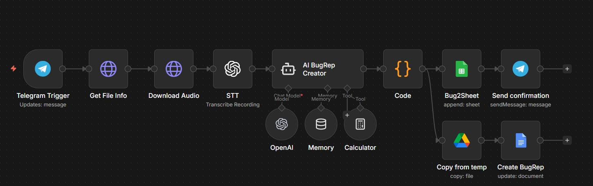
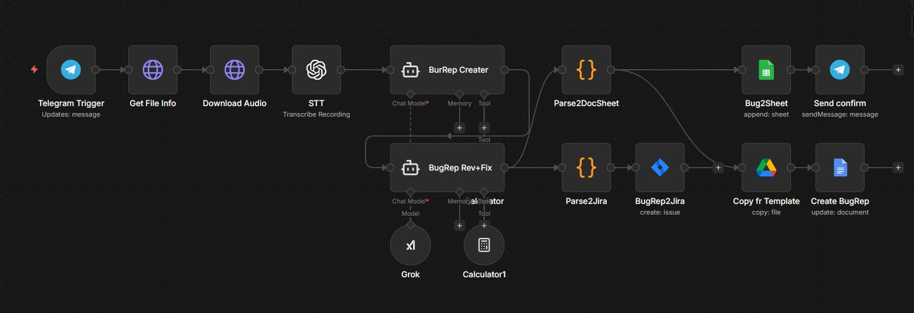

# AI Voice Bug Reporting System (Telegram + n8n + AI + Google Workspace)

## 🎥 Demo Video

👉 https://drive.google.com/file/d/11oUJQ0CylXdoS_gFuKGbYUOKk5cT2aGr/view?usp=drive_link

---

## 📸 System Overview




---

## Problem Statement (Motivation)

In real QA workflows, bug reporting is often performed during active testing sessions, where speed and accuracy are critical.

However, the traditional process introduces friction:

- QA engineers manually write structured bug reports
- Context is lost between discovery and documentation
- Voice notes are not structured or standardized
- Switching between tools slows down testing flow
- Formatting takes additional cognitive effort

As a result, valuable information can be lost or simplified.

This project aims to eliminate that friction by introducing a **voice-first AI-powered bug reporting system directly inside Telegram**.

---

## Solution Overview

This system transforms unstructured voice input into structured QA artifacts.

A QA engineer can simply describe a bug via voice message in Telegram, and the system automatically:

- transcribes audio into text
- extracts structured bug data using LLM
- generates a standardized bug report
- stores data in Google Sheets
- creates a formatted Google Docs report
- sends confirmation back to Telegram

---

## Architecture

```text
Telegram Voice Message
        ↓
Audio Retrieval (Telegram API)
        ↓
Speech-to-Text (OpenAI)
        ↓
LLM Bug Parsing (AI Agent)
        ↓
Structured JSON Output
        ↓
Google Sheets Storage
        ↓
Google Docs Generation
        ↓
Telegram Response
        ↓
Jira issue task create (v2)
